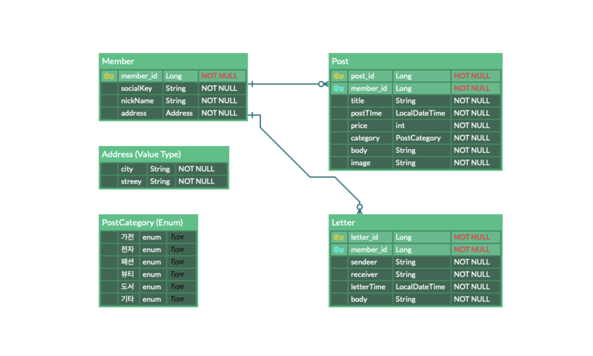

# WonMart

중고거래장터 웹 어플리케이션

## 소개 및 개요

- 중고 거래 물품 공유 및 기타 컨텐츠의 CRUD를 활용한 소통 기반 웹 어플리케이션 개발을 목표로 한다.
- 도메인 설계와 JPA 응용, 소셜 서비스 활용 및 Spring MVC 구동 원리를 이해함으로써 Spring Framework에 대한 활용 능력을 높인다.

## Contributors

- w-son : API 설계 및 활용
- hangeulisbest : 도메인 및 디자인 설계

## 개발 환경
- JDK version 12.0.1
- Spring Boot 2.1.9 release
- Spring web mvc, thymeleaf, jpa, h2, lombok

## 테이블 설계

## 기능 구성 
- Login API (Facebook, Google, Kakao, Naver)
- Member, Post, Letter CRUD
- Dynamic JPQL with QueryDSL
- Validation, WebConfiguration Customized
- API resources

### API Usage

- 준비중
